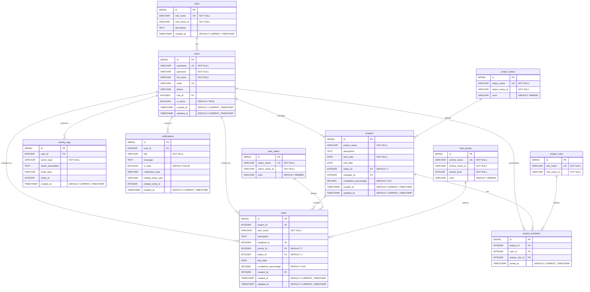

# Database Schema Diagram - نظام إدارة المشاريع
## Project Management System - Database Schema

---

## Entity Relationship Diagram (ERD)



---

## Database Schema Overview

### Tables Summary (11 Tables)

| # | Table Name | Arabic Name | Purpose | Records |
|---|------------|-------------|---------|---------|
| 1 | `roles` | الأدوار | User system roles | 2 |
| 2 | `users` | المستخدمين | User accounts | Dynamic |
| 3 | `project_status` | حالات المشروع | Project status types | 5 |
| 4 | `projects` | المشاريع | Project information | Dynamic |
| 5 | `project_roles` | أدوار أعضاء المشروع | Project member roles | 5 |
| 6 | `project_members` | أعضاء المشروع | Project team members | Dynamic |
| 7 | `task_status` | حالات المهام | Task status types | 5 |
| 8 | `task_priority` | أولويات المهام | Task priority levels | 4 |
| 9 | `tasks` | المهام | Task information | Dynamic |
| 10 | `activity_logs` | سجل الأنشطة | System activity logs | Dynamic |
| 11 | `notifications` | الإشعارات | User notifications | Dynamic |

---

## Detailed Table Structures

### 1. roles (الأدوار)
**Purpose:** Define system-wide user roles

| Column | Type | Constraints | Description |
|--------|------|-------------|-------------|
| id | SERIAL | PRIMARY KEY | Unique identifier |
| role_name | VARCHAR(50) | NOT NULL, UNIQUE | Role name in English |
| role_name_ar | VARCHAR(50) | NOT NULL | Role name in Arabic |
| description | TEXT | - | Role description |
| created_at | TIMESTAMP | DEFAULT CURRENT_TIMESTAMP | Creation timestamp |

**Default Data:**
- PROJECT_MANAGER (مدير مشروع)
- TEAM_MEMBER (عضو فريق)

---

### 2. users (المستخدمين)
**Purpose:** Store user account information

| Column | Type | Constraints | Description |
|--------|------|-------------|-------------|
| id | SERIAL | PRIMARY KEY | Unique identifier |
| username | VARCHAR(50) | NOT NULL, UNIQUE | Login username |
| password | VARCHAR(255) | NOT NULL | User password |
| full_name | VARCHAR(100) | NOT NULL | Full name |
| email | VARCHAR(100) | UNIQUE | Email address |
| phone | VARCHAR(20) | - | Phone number |
| role_id | INTEGER | FOREIGN KEY → roles(id) | User role |
| is_active | BOOLEAN | DEFAULT TRUE | Account status |
| created_at | TIMESTAMP | DEFAULT CURRENT_TIMESTAMP | Creation timestamp |
| updated_at | TIMESTAMP | DEFAULT CURRENT_TIMESTAMP | Last update timestamp |

**Relationships:**
- Many-to-One with `roles`
- One-to-Many with `projects` (as manager)
- One-to-Many with `tasks` (as assignee/creator)
- One-to-Many with `activity_logs`
- One-to-Many with `notifications`
- Many-to-Many with `projects` (via `project_members`)

---

### 3. project_status (حالات المشروع)
**Purpose:** Define project status types

| Column | Type | Constraints | Description |
|--------|------|-------------|-------------|
| id | SERIAL | PRIMARY KEY | Unique identifier |
| status_name | VARCHAR(50) | NOT NULL, UNIQUE | Status name in English |
| status_name_ar | VARCHAR(50) | NOT NULL | Status name in Arabic |
| color | VARCHAR(20) | DEFAULT '#808080' | Display color |

**Default Data:**
1. NOT_STARTED (لم يبدأ) - #9E9E9E
2. IN_PROGRESS (قيد التنفيذ) - #2196F3
3. ON_HOLD (متوقف) - #FF9800
4. COMPLETED (مكتمل) - #4CAF50
5. CANCELLED (ملغي) - #F44336

---

### 4. projects (المشاريع)
**Purpose:** Store project information

| Column | Type | Constraints | Description |
|--------|------|-------------|-------------|
| id | SERIAL | PRIMARY KEY | Unique identifier |
| project_name | VARCHAR(200) | NOT NULL | Project name |
| description | TEXT | - | Project description |
| start_date | DATE | NOT NULL | Start date |
| end_date | DATE | - | End date |
| status_id | INTEGER | FOREIGN KEY → project_status(id), DEFAULT 1 | Project status |
| manager_id | INTEGER | FOREIGN KEY → users(id) | Project manager |
| completion_percentage | DECIMAL(5,2) | DEFAULT 0.00 | Completion percentage (0-100) |
| created_at | TIMESTAMP | DEFAULT CURRENT_TIMESTAMP | Creation timestamp |
| updated_at | TIMESTAMP | DEFAULT CURRENT_TIMESTAMP | Last update timestamp |

**Relationships:**
- Many-to-One with `project_status`
- Many-to-One with `users` (manager)
- One-to-Many with `tasks`
- One-to-Many with `project_members`

---

### 5. project_roles (أدوار أعضاء المشروع)
**Purpose:** Define roles within projects

| Column | Type | Constraints | Description |
|--------|------|-------------|-------------|
| id | SERIAL | PRIMARY KEY | Unique identifier |
| role_name | VARCHAR(50) | NOT NULL, UNIQUE | Role name in English |
| role_name_ar | VARCHAR(50) | NOT NULL | Role name in Arabic |

**Default Data:**
1. LEADER (قائد الفريق)
2. DEVELOPER (مطور)
3. DESIGNER (مصمم)
4. TESTER (مختبر)
5. ANALYST (محلل)

---

### 6. project_members (أعضاء المشروع)
**Purpose:** Link users to projects with roles

| Column | Type | Constraints | Description |
|--------|------|-------------|-------------|
| id | SERIAL | PRIMARY KEY | Unique identifier |
| project_id | INTEGER | FOREIGN KEY → projects(id) ON DELETE CASCADE | Project reference |
| user_id | INTEGER | FOREIGN KEY → users(id) ON DELETE CASCADE | User reference |
| project_role_id | INTEGER | FOREIGN KEY → project_roles(id) | Role in project |
| joined_at | TIMESTAMP | DEFAULT CURRENT_TIMESTAMP | Join timestamp |

**Constraints:**
- UNIQUE(project_id, user_id) - User can only join a project once

**Relationships:**
- Many-to-One with `projects`
- Many-to-One with `users`
- Many-to-One with `project_roles`

**Index:**
- idx_project_members_project_id
- idx_project_members_user_id

---

### 7. task_status (حالات المهام)
**Purpose:** Define task status types

| Column | Type | Constraints | Description |
|--------|------|-------------|-------------|
| id | SERIAL | PRIMARY KEY | Unique identifier |
| status_name | VARCHAR(50) | NOT NULL, UNIQUE | Status name in English |
| status_name_ar | VARCHAR(50) | NOT NULL | Status name in Arabic |
| color | VARCHAR(20) | DEFAULT '#808080' | Display color |

**Default Data:**
1. TODO (للتنفيذ) - #9E9E9E
2. IN_PROGRESS (قيد التنفيذ) - #2196F3
3. REVIEW (قيد المراجعة) - #FF9800
4. COMPLETED (مكتملة) - #4CAF50
5. BLOCKED (معلقة) - #F44336

---

### 8. task_priority (أولويات المهام)
**Purpose:** Define task priority levels

| Column | Type | Constraints | Description |
|--------|------|-------------|-------------|
| id | SERIAL | PRIMARY KEY | Unique identifier |
| priority_name | VARCHAR(50) | NOT NULL, UNIQUE | Priority name in English |
| priority_name_ar | VARCHAR(50) | NOT NULL | Priority name in Arabic |
| priority_level | INTEGER | NOT NULL | Priority level (1-4) |
| color | VARCHAR(20) | DEFAULT '#808080' | Display color |

**Default Data:**
1. LOW (منخفضة) - Level 1 - #4CAF50
2. MEDIUM (متوسطة) - Level 2 - #FF9800
3. HIGH (عالية) - Level 3 - #F44336
4. CRITICAL (حرجة) - Level 4 - #9C27B0

---

### 9. tasks (المهام)
**Purpose:** Store task information

| Column | Type | Constraints | Description |
|--------|------|-------------|-------------|
| id | SERIAL | PRIMARY KEY | Unique identifier |
| project_id | INTEGER | FOREIGN KEY → projects(id) ON DELETE CASCADE | Parent project |
| task_name | VARCHAR(200) | NOT NULL | Task name |
| description | TEXT | - | Task description |
| assigned_to | INTEGER | FOREIGN KEY → users(id) | Assigned user |
| priority_id | INTEGER | FOREIGN KEY → task_priority(id), DEFAULT 2 | Task priority |
| status_id | INTEGER | FOREIGN KEY → task_status(id), DEFAULT 1 | Task status |
| due_date | DATE | - | Due date |
| completion_percentage | DECIMAL(5,2) | DEFAULT 0.00 | Completion percentage (0-100) |
| created_by | INTEGER | FOREIGN KEY → users(id) | Creator user |
| created_at | TIMESTAMP | DEFAULT CURRENT_TIMESTAMP | Creation timestamp |
| updated_at | TIMESTAMP | DEFAULT CURRENT_TIMESTAMP | Last update timestamp |

**Relationships:**
- Many-to-One with `projects`
- Many-to-One with `users` (assigned_to)
- Many-to-One with `users` (created_by)
- Many-to-One with `task_priority`
- Many-to-One with `task_status`

**Indexes:**
- idx_tasks_project_id
- idx_tasks_assigned_to
- idx_tasks_status_id

---

### 10. activity_logs (سجل الأنشطة)
**Purpose:** Track all system activities

| Column | Type | Constraints | Description |
|--------|------|-------------|-------------|
| id | SERIAL | PRIMARY KEY | Unique identifier |
| user_id | INTEGER | FOREIGN KEY → users(id) | User who performed action |
| action_type | VARCHAR(50) | NOT NULL | Type of action |
| action_description | TEXT | - | Action description |
| entity_type | VARCHAR(50) | - | Affected entity type |
| entity_id | INTEGER | - | Affected entity ID |
| created_at | TIMESTAMP | DEFAULT CURRENT_TIMESTAMP | Action timestamp |

**Relationships:**
- Many-to-One with `users`

**Index:**
- idx_activity_logs_user_id

**Tracked Actions:**
- User login/logout
- Project create/update/delete
- Task create/update/delete
- Member add/remove
- Status changes

---

### 11. notifications (الإشعارات)
**Purpose:** Store user notifications

| Column | Type | Constraints | Description |
|--------|------|-------------|-------------|
| id | SERIAL | PRIMARY KEY | Unique identifier |
| user_id | INTEGER | FOREIGN KEY → users(id) ON DELETE CASCADE | Recipient user |
| title | VARCHAR(200) | NOT NULL | Notification title |
| message | TEXT | - | Notification message |
| is_read | BOOLEAN | DEFAULT FALSE | Read status |
| notification_type | VARCHAR(50) | - | Notification type |
| related_entity_type | VARCHAR(50) | - | Related entity type |
| related_entity_id | INTEGER | - | Related entity ID |
| created_at | TIMESTAMP | DEFAULT CURRENT_TIMESTAMP | Creation timestamp |

**Relationships:**
- Many-to-One with `users`

**Index:**
- idx_notifications_user_id

**Notification Types:**
- Task assignment
- Due date reminder
- Task completion
- Project update
- Member addition

---

## Relationships Summary

### One-to-Many Relationships

```
roles (1) ──────────── (∞) users
users (1) ──────────── (∞) projects [as manager]
users (1) ──────────── (∞) tasks [as assigned_to]
users (1) ──────────── (∞) tasks [as created_by]
users (1) ──────────── (∞) activity_logs
users (1) ──────────── (∞) notifications

project_status (1) ─── (∞) projects
projects (1) ────────── (∞) tasks
projects (1) ────────── (∞) project_members

project_roles (1) ───── (∞) project_members

task_status (1) ─────── (∞) tasks
task_priority (1) ───── (∞) tasks
```

### Many-to-Many Relationships

```
users (∞) ←──── project_members ────→ (∞) projects
```

---

## Indexes for Performance Optimization

```sql
-- Task indexes
CREATE INDEX idx_tasks_project_id ON tasks(project_id);
CREATE INDEX idx_tasks_assigned_to ON tasks(assigned_to);
CREATE INDEX idx_tasks_status_id ON tasks(status_id);

-- Project member indexes
CREATE INDEX idx_project_members_project_id ON project_members(project_id);
CREATE INDEX idx_project_members_user_id ON project_members(user_id);

-- Activity log index
CREATE INDEX idx_activity_logs_user_id ON activity_logs(user_id);

-- Notification index
CREATE INDEX idx_notifications_user_id ON notifications(user_id);
```

---

## Cascading Delete Rules

### ON DELETE CASCADE

When a parent record is deleted, child records are automatically deleted:

1. **projects → tasks**
   - Deleting a project deletes all its tasks

2. **projects → project_members**
   - Deleting a project removes all member associations

3. **users → project_members**
   - Deleting a user removes all project memberships

4. **users → notifications**
   - Deleting a user deletes all their notifications

---

## Data Integrity Constraints

### Primary Keys
- All tables have a `SERIAL` primary key named `id`

### Foreign Keys
- Maintain referential integrity between related tables
- Prevent orphaned records

### Unique Constraints
- `roles.role_name`
- `users.username`
- `users.email`
- `project_status.status_name`
- `project_roles.role_name`
- `task_status.status_name`
- `task_priority.priority_name`
- `project_members(project_id, user_id)` - Composite unique

### Not Null Constraints
- Essential fields that cannot be empty
- Ensures data completeness

### Default Values
- Timestamps: `CURRENT_TIMESTAMP`
- Booleans: `TRUE` or `FALSE`
- Completion percentages: `0.00`
- Status IDs: Default to initial status

---

## Database Size Estimation

### Static Tables (Lookup/Reference)
- `roles`: ~2 records
- `project_status`: 5 records
- `project_roles`: 5 records
- `task_status`: 5 records
- `task_priority`: 4 records
- **Total:** ~21 records

### Dynamic Tables (Transactional)
- `users`: Grows with user base
- `projects`: Grows with business
- `tasks`: Grows significantly (many per project)
- `project_members`: Grows with team assignments
- `activity_logs`: Grows continuously (audit trail)
- `notifications`: Grows continuously (can be archived)

---

## Schema Diagram (Text-Based)

```
┌─────────────┐
│    roles    │
│─────────────│
│ id (PK)     │
│ role_name   │
└──────┬──────┘
       │
       │ 1:∞
       │
┌──────▼──────────────┐
│       users         │
│─────────────────────│
│ id (PK)             │
│ username            │
│ role_id (FK)        │
└──┬──────────────┬───┘
   │              │
   │ 1:∞          │ 1:∞
   │              │
┌──▼──────────┐  │  ┌────────────────┐
│  projects   │  │  │     tasks      │
│─────────────│  │  │────────────────│
│ id (PK)     │  │  │ id (PK)        │
│ manager_id  │◄─┘  │ assigned_to    │
│ status_id   │     │ created_by     │
└──┬──────────┘     │ project_id     │
   │                │ priority_id    │
   │ 1:∞            │ status_id      │
   │                └────────────────┘
┌──▼──────────────┐
│ project_members │
│─────────────────│
│ id (PK)         │
│ project_id (FK) │
│ user_id (FK)    │
│ role_id (FK)    │
└─────────────────┘
```

---

## Visual Schema (Simplified)

```
                    ┌──────────────┐
                    │ project_status│
                    └───────┬──────┘
                            │
        ┌───────────────────┼───────────────────┐
        │                   │                   │
    ┌───▼────┐         ┌────▼─────┐      ┌─────▼────┐
    │ roles  │         │ projects │      │task_status│
    └───┬────┘         └────┬─────┘      └─────┬────┘
        │                   │                   │
        │              ┌────┴────┐              │
        │              │         │              │
    ┌───▼─────┐   ┌───▼───┐ ┌───▼──────────┐   │
    │  users  │───│ tasks │ │project_members│   │
    └─┬───┬───┘   └───┬───┘ └──────────────┘   │
      │   │           │                         │
      │   │           └─────────────────────────┘
      │   │
      │   └──────────┐
      │              │
┌─────▼────┐   ┌─────▼─────────┐
│activity_ │   │notifications  │
│  logs    │   │               │
└──────────┘   └───────────────┘
```

---

## Connection String Example

```java
// PostgreSQL JDBC Connection
String url = "jdbc:postgresql://localhost:5432/project_management_db";
String user = "postgres";
String password = "your_password";

Connection conn = DriverManager.getConnection(url, user, password);
```

---

## Backup and Maintenance

### Recommended Backup Strategy
```bash
# Full database backup
pg_dump -U postgres project_management_db > backup_$(date +%Y%m%d).sql

# Restore from backup
psql -U postgres project_management_db < backup_20241231.sql
```

### Maintenance Tasks
- Regular VACUUM to reclaim storage
- ANALYZE to update statistics
- Monitor index usage
- Archive old activity_logs and notifications
- Regular backup schedule

---

**Created:** December 31, 2024  
**Version:** 1.0  
**Database:** PostgreSQL 12+  
**Schema Tables:** 11  
**Total Relationships:** 15+

---

*Project Management System - Database Schema Documentation* 📊
